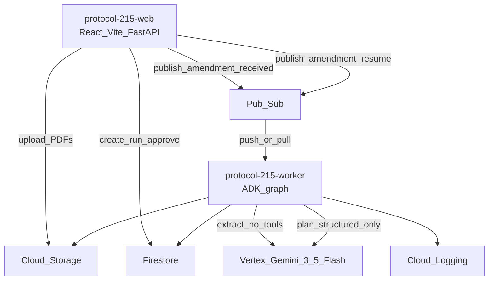
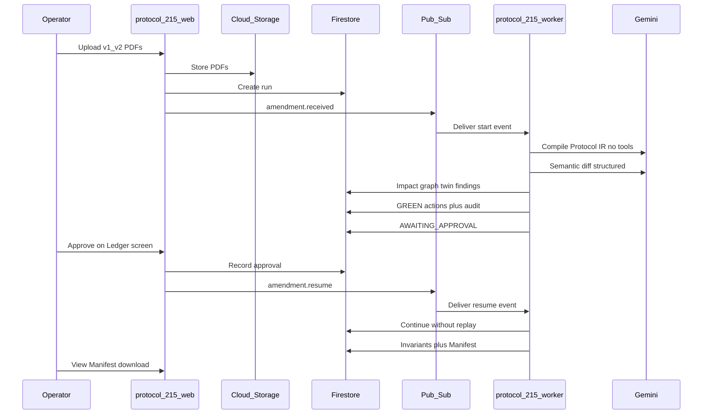
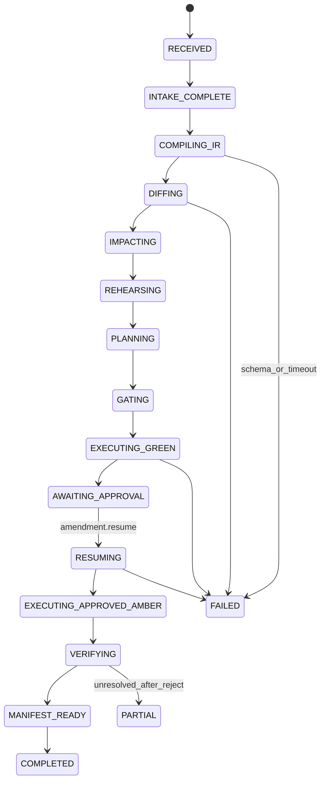

# ARCHITECTURE.md — Protocol 215

**Runtime stack:** Python 3.12 · FastAPI · Pydantic 2 · Gemini 3.5 Flash (Vertex AI / Google Gen AI SDK) · Google ADK 2.x graph · Cloud Run · GCS · Pub/Sub · Firestore · Cloud Logging · React · TypeScript · Vite

## Cloud topology

### Two Cloud Run services

| Service | Responsibility |
| --- | --- |
| `protocol-215-web` | FastAPI + React UI: upload, run status, seven screens, approval POST, artifact download. **Never** blocks HTTP waiting for human approval. |
| `protocol-215-worker` | Pub/Sub consumer; Google ADK 2.x graph; Gemini calls; tool execution; invariants; manifest. |

### Managed services

- **Cloud Storage** — protocol PDFs and generated artifacts (manifest HTML/JSON, optional IR dumps).
- **Pub/Sub** — `amendment.received` (start) and `amendment.resume` (post-approval).
- **Firestore** — runs, IR, changes, twin state, findings, actions, approvals, hash-chained audit, invariants, manifests.
- **Vertex AI** — Gemini 3.5 Flash (`GEMINI_MODEL` env).
- **Cloud Logging** — worker/tool/Pub/Sub evidence for demo.

### Local adapters

Deterministic core and ADK graph must run locally with fixtures and/or emulators (Pub/Sub + Firestore emulators or in-process fakes). GCS can use local filesystem adapter in dev.

## Component diagram



## End-to-end data flow



**Rule:** After AMBER pause, the web service returns immediately. Approval creates Firestore state and publishes `amendment.resume`. The worker starts a **new consumption** of the resume event, loading checkpointed run state — it does not hold an open HTTP request.

## ADK workflow state machine



Checkpoint cursor + completed idempotency keys live in Firestore. Resume loads them and skips finished GREEN work. RED never executes.

## Model isolation

| Role | Input | Tools | Output |
| --- | --- | --- | --- |
| Protocol extraction | PDF bytes / page text only | **None** | Protocol IR (Pydantic) |
| Semantic diff | Two IRs only | **None** | SemanticChange list |
| Action planner | IR summaries, changes, findings, twin ops facts — **never raw PDF** | Propose allowlisted tool names + args only | ProposedAction list |

Authorization is **not** a model decision.

## Proposed monorepo tree

```text
protocol-215/
├── PRODUCT.md RULES.md ARCHITECTURE.md SECURITY.md
├── EVALUATION.md AGENTS.md DECISIONS.md ROADMAP.md
├── docs/PROTOCOL_215_INPUT.md
├── apps/
│   ├── web/                 # FastAPI + Vite React (protocol-215-web)
│   └── worker/              # ADK graph consumer (protocol-215-worker)
├── packages/
│   ├── models/              # Pydantic domain + Gemini I/O schemas
│   ├── intake/              # hash, validate, GCS
│   ├── protocol_ir/
│   ├── semantic_diff/
│   ├── impact_graph/        # deterministic
│   ├── trial_twin/          # deterministic rehearsal
│   ├── policy/              # GREEN/AMBER/RED
│   ├── tools_runtime/
│   ├── audit/               # hash-chained append-only
│   ├── invariants/
│   └── manifest/
├── fixtures/                # AURORA PDFs, twin, gold changes
├── tests/
├── deploy/
└── scripts/run_local.sh
```

## Domain-model inventory

- `ProtocolDocument`, `Run`, `EvidenceRef`, `IRFact`, `ProtocolIR`
- `SemanticChange`, `ImpactEdge`
- `Site`, `Participant`, `Visit`, `InventoryItem`, `CourierWindow`, `StorageCapability`
- `Finding`, `ProposedAction`, `PolicyDecision`, `ActionRecord`
- `ApprovalRequest`, `ApprovalDecision`
- `InvariantResult`, `ReleaseManifest`
- `AuditEvent` (prev_hash, event_hash, run_id, action_id, evidence, before, after, idempotency_key, timestamp, tool_id)

## Tool allowlist

| Tool | Typical tier |
| --- | --- |
| `update_contact_directory` | GREEN |
| `create_site_training_task` | GREEN |
| `reserve_sample_kits` | GREEN |
| `create_lab_manual_change_request` | GREEN |
| `create_edc_change_specification` | GREEN |
| `create_courier_exception_task` | GREEN prep / AMBER-gated resolution |
| `create_reconsent_review` | AMBER |
| `draft_participant_transition_plan` | AMBER |
| `request_human_approval` | pause / AWAITING_APPROVAL |
| `generate_release_manifest` | GREEN |

Unknown tools are rejected by deterministic code.

## GREEN / AMBER / RED policy matrix

| Tier | Examples | Behavior |
| --- | --- | --- |
| **GREEN** | Admin contact update; training task; reserve PK kits; draft EDC/lab-manual specs | Auto-execute; audit |
| **AMBER** | Participant schedule change; new sample collection; fasting; ECG; site activation; reconsent; Phoenix logistics resolution | UI approval required; resume via `amendment.resume` |
| **RED** | Dose/route/treatment assignment; eligibility; remove safety monitoring; alter completed visits; activate informed consent; real participant data | Never execute (UI approve cannot override) |

Missing evidence, contradictory evidence, or low-confidence consequential extraction → block or AMBER; never silent GREEN.

## Firestore collections (summary)

`runs`, `protocol_irs`, `changes`, `impact_edges`, `sites`, `participants`, `findings`, `proposed_actions`, `actions`, `approvals`, `audit_events`, `invariants`, `manifests` — keyed by `run_id` where applicable. Synthetic system views may nest under `runs/{id}/systems/...`.

## UI screens

1. Amendment Launch  
2. Semantic Redline  
3. Impact Graph  
4. 215-Day Rollout Timeline  
5. Rehearsal Findings  
6. Action Ledger + Human Approval  
7. Amendment Release Manifest  
