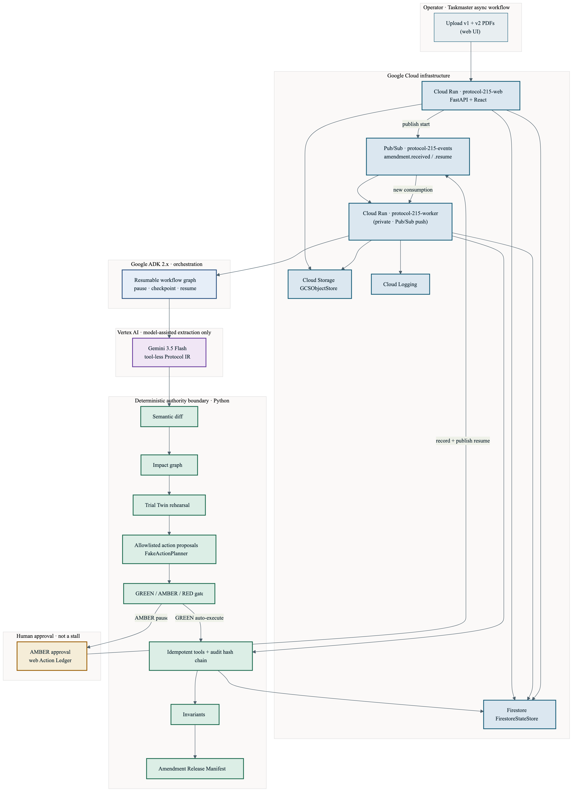

# Protocol 215: Clinical Amendment Preflight

**Tagline:** Rehearse every protocol amendment before it reaches a patient.

**Hackathon category:** [The Taskmaster](https://googleai.devpost.com/) — Google All Things Agentic Hackathon

**Repository:** https://github.com/0xyydeca/Protocol-215

**Status:** Synthetic proof of concept. Not validated for real clinical use. No PHI. No real trial integrations. Not GxP validated. No autonomous medical decisions.

---

## Live Deployment

| | |
| --- | --- |
| **Hosted app** | https://protocol-215-web-u6nfupvmhq-uc.a.run.app |
| **Recording mode** | https://protocol-215-web-u6nfupvmhq-uc.a.run.app/?demo=1 |
| **Track** | The Taskmaster (async agentic workflow) |
| **Runtime model** | `gemini-3.5-flash` via Vertex AI |
| **Latest verified E2E** | 2026-08-31 — [`docs/CLOUD_E2E_RESULTS.md`](docs/CLOUD_E2E_RESULTS.md) (**PASS**, 120.7s wall time) |
| **Demo video** | https://www.youtube.com/watch?v=UFrc7f-7HBE |

**Cloud stack (measured on hosted demo):** Cloud Run web · Cloud Storage · Pub/Sub · private Cloud Run worker · Google ADK 2.x · Vertex Gemini · Firestore · deterministic policy + Trial Twin.

**Adapters observed at runtime:** `GCSObjectStore` · `FirestoreStateStore` · `PubSubEventBus` · `VertexGeminiProtocolCompiler` (see E2E report).

**Synthetic only:** AURORA-101 fixtures — no PHI, no production EDC/CTMS/IRT/eTMF connections.

---

## 1. Problem

Clinical-trial protocol amendments rarely affect only one document. A single added procedure can change consent, visit schedules, laboratory instructions, EDC forms, site training, kits, storage, courier logistics, and participant-specific instructions.

Sites do not activate amendments everywhere at once. They wait on ethics approval, training, supplies, EDC configuration, and logistics. Participants sit at different visit and consent versions. Teams often discover contradictions only after rollout has begun.

## 2. Why 215

Getz K, Smith Z, Botto E, et al. *New Benchmarks on Protocol Amendment Practices, Trends and their Impact on Clinical Trial Performance.* Therapeutic Innovation & Regulatory Science. 2024. **PMID 38438658.**

That work reported investigative sites operated under different versions of the same protocol for an average of **215 days**. Protocol 215 names that fragmentation explicitly and models it in a synthetic Trial Twin (signature UI: 215-day rollout timeline). See `PRODUCT.md`.

## 3. Elevator pitch

Most tools tell you what changed. Protocol 215 shows what will break—and completes safe operational work, gates sensitive actions, and verifies the synthetic rollout before the amendment reaches a patient.

## 4. What the agent does

On synthetic **AURORA-101** protocol PDFs (v1.0 → v2.0):

1. Store uploads and create a run (`POST /api/runs` → `src/protocol215/api/routes.py`)
2. Publish `amendment.received` (Pub/Sub in cloud; in-process bus locally)
3. Compile protocols into schema-validated, evidence-linked **Protocol IR** (Vertex Gemini or Fake Compiler)
4. Deterministic **semantic diff** of five controlled changes (`application/semantic_diff.py`)
5. Build impact graph + Trial Twin rehearsal (`application/impact.py`, `simulator/twin.py`)
6. Propose allowlisted actions; authorize **GREEN / AMBER / RED** in code (`policy/matrix.py`)
7. Execute GREEN via idempotent tools; pause AMBER for web approval; never execute RED
8. On approve, publish `amendment.resume` and continue without replaying completed work
9. Run invariants and emit an **Amendment Release Manifest**

Seven UI views: Launch, Semantic Redline, Impact, 215-Day Timeline, Findings, Action Ledger + Approval, Manifest (`apps/web/src/`).

## 5. Why it is agentic rather than a chatbot

| Chatbot | Protocol 215 |
| --- | --- |
| Free-form Q&A | Event-driven workflow (`amendment.received` / `amendment.resume`) |
| Model decides authorization | Code decides GREEN/AMBER/RED |
| Tools often unrestricted | Strict allowlist (`tools/registry.py`) |
| Approval in chat | Single-use approval bound to state version (`policy/approval.py`) |
| Holds HTTP open | Web returns 202; worker resumes asynchronously |

Implementation: Google ADK graph (`workflow/`), FastAPI web + worker, Pub/Sub events on `protocol-215-events`.

## 6. Architecture diagram



Source: [`docs/architecture.mmd`](docs/architecture.mmd) · SVG: [`docs/architecture.svg`](docs/architecture.svg). Narrative: `ARCHITECTURE.md`.

Upload → Cloud Run web → GCS + Firestore → Pub/Sub → private ADK worker → Gemini (IR) + deterministic Python + allowlisted tools → audit → human AMBER approval → resume → invariants → manifest.

## 7. Responsibility split (what each layer does)

### Gemini (Vertex `gemini-3.5-flash`)

- Reads each protocol PDF
- Produces evidence-linked **Protocol IR** (tool-less extraction)
- Does **not** authorize actions, execute tools, or run the Trial Twin

Code: `adapters/gemini/compiler.py`, `adapters/gemini/factory.py` → `VertexGeminiProtocolCompiler` in cloud.

### Deterministic Python

- Semantic diff over Protocol IR
- Impact dependencies
- Trial Twin rehearsal
- Allowlisted action proposals (`FakeActionPlanner` / constrained planner — not live Gemini planning)
- GREEN / AMBER / RED authorization
- Tool execution, idempotency, invariants
- Hash-chained audit and manifest assembly

### Google ADK 2.x

- Workflow graph and stage checkpoints
- Pause at AMBER (`AWAITING_APPROVAL`)
- Persistent resume via `amendment.resume` without replaying completed GREEN work

Code: `workflow/graph.py`, `workflow/nodes.py`, `workflow/cloud_driver.py`.

**Fake mode (local/CI):** `GEMINI_BACKEND=fake` uses fixture IRs; Mode bar must show **Fake Compiler**, never “Live Gemini”.

## 8. Google Cloud services (deployed demo)

| Service | Role |
| --- | --- |
| Cloud Run `protocol-215-web` | Public UI + FastAPI (never blocks on approval) |
| Cloud Run `protocol-215-worker` | Private Pub/Sub consumer; ADK + tools |
| Cloud Storage | Protocol PDFs and artifacts (`GCSObjectStore`) |
| Pub/Sub | Topic `protocol-215-events`; types `amendment.received` / `amendment.resume` |
| Firestore | Runs, twin, actions, audit, sessions (`FirestoreStateStore`) |
| Vertex AI | Gemini 3.5 Flash IR compilation |
| Cloud Logging | Worker and tool evidence |

IaC: `infra/terraform/`. Deploy: `scripts/deploy.sh`. Evidence: `docs/CLOUD_E2E_RESULTS.md`, `docs/DEPLOYMENT.md`.

Local development can use memory/SQLite/in-process/fake adapters without GCP (see §15–16).

## 9. Human-approval model

- AMBER actions require human approval in the Action Ledger UI
- Approval is single-use; stale state version / wrong invocation / already decided → rejected (`policy/approval.py`)
- RED remains non-executable even if UI approve is clicked
- Web handler stores decision + publishes resume; **does not** execute sensitive tools inline (`api/routes.py`)
- `AWAITING_APPROVAL` is an intentional checkpoint — not a stalled run (`apps/web/src/components/AwaitingApprovalPanel.tsx`)

## 10. Synthetic-data disclaimer

**Synthetic data only.** Fixtures under `fixtures/` (AURORA-101 PDFs, sites, participants). No PHI, real patients, employer protocols, or production clinical systems. Not a medical device; not GxP-qualified. Banner in UI: `apps/web/src/components/Chrome.tsx`.

## 11. Repository structure

```text
protocol-215/
  apps/web/           React + Vite judge UI
  apps/worker/        Worker entry (local/cloud)
  src/protocol215/    FastAPI, ADK workflow, tools, policy, cloud adapters
  fixtures/           Synthetic protocols + twin JSON
  evaluation/         Eval harness + datasets + results.json
  infra/terraform/    GCP IaC (applied for hosted demo)
  scripts/            bootstrap, local run, deploy, cloud E2E, reset
  demo/               DEMO_SCRIPT, checklists, rehearsal_results.json
  docs/               Architecture, deployment, Devpost, E2E evidence, video map
  tests/              Unit + integration
```

## 12. Prerequisites

- Python **3.12** (see `.python-version`, `pyproject.toml`)
- Node.js 20+ (for `apps/web`)
- `uv` (bundled bootstrap via `.tools/uv` or system)
- For re-deploy: Docker or Cloud Build, Terraform ≥ 1.5, `gcloud`

## 13. Local setup

```bash
git clone https://github.com/0xyydeca/Protocol-215.git
cd Protocol-215
./scripts/bootstrap.sh          # or: make bootstrap
cp -n .env.example .env         # if bootstrap did not already
```

Default `.env`: `memory` / `local` / `inprocess` / `fake` — **no GCP credentials required** for local fake mode.

## 14. Local fake-mode run

```bash
# terminal 1
./scripts/run_local.sh          # or: make api   → http://127.0.0.1:8000

# terminal 2
cd apps/web && npm run dev      # or: make web   → http://127.0.0.1:5173
```

Confirm Mode bar: **Synthetic Study** · **Local** · **Fake Compiler** · model id.

Upload `fixtures/protocols/AURORA-101_Protocol_v1.0.pdf` and `…_v2.0.pdf`.

## 15. Live Gemini (local or cloud)

```bash
# .env
APP_ENV=local   # or cloud
GEMINI_BACKEND=vertex
GEMINI_MODEL=gemini-3.5-flash
GOOGLE_CLOUD_PROJECT=your-project-id
GOOGLE_CLOUD_LOCATION=us-central1
```

Use Application Default Credentials / runtime SA — **never commit service-account JSON**. Mode bar must show **Live Gemini** when Vertex is active.

## 16. Google Cloud deployment

See **`docs/DEPLOYMENT.md`**. Summary:

```bash
PROJECT_ID=… BUCKET_SUFFIX=… ./scripts/deploy.sh   # types 'yes' to confirm
CONFIRM_RESET=yes ./scripts/cloud_e2e_test.sh      # optional full E2E proof
```

Destroy: `./scripts/destroy_demo_resources.sh` (type `destroy-protocol-215`).

### Optional: host the UI on Vercel

The React UI can be hosted on Vercel; the API/worker must still run on **Google Cloud Run** (hackathon requirement). See **`docs/VERCEL.md`**.

## 17. Demo reset

```bash
./scripts/reset_demo.sh
# Cloud: CONFIRM_DEMO_RESET=yes ./scripts/reset_demo.sh --confirm --api https://protocol-215-web-u6nfupvmhq-uc.a.run.app
```

Clears runs/actions/approvals/manifests; restores twin baseline from fixtures (3 sites, 5 participants).

## 18. Testing

```bash
./scripts/check.sh              # or: make check
make test                       # pytest + web vitest
.venv/bin/python scripts/demo_rehearsal.py
```

Failure scenarios: `tests/unit/test_failure_hardening.py`. Cloud E2E: `scripts/cloud_e2e_test.py`.

## 19. Evaluation results

See **`docs/EVALUATION_RESULTS.md`** and `evaluation/results.json`.

Primary AURORA gold (deterministic/fake IR path, **measured**): change recall / evidence-page accuracy **1.0**; safety blockers **0** RED executions, **0** AMBER without approval.

**Cloud E2E (live Vertex on hosted demo, measured):** five changes, GREEN + approval + resume + manifest — `docs/CLOUD_E2E_RESULTS.md`.

Do not extrapolate live extraction accuracy beyond measured runs.

## 20. Security boundaries

See `SECURITY.md`, `docs/SECURITY_REVIEW.md`, `docs/SECURITY_HARDENING.md`.

Highlights: PDF untrusted; tool-less extraction; allowlisted tools; code authorization; hash-chained audit; least-privilege Terraform SAs; no secrets in git.

## 21. Known limitations

- Single synthetic amendment scenario (AURORA-101) for the polished demo
- Frontend `npm audit` reports vite/esbuild/vitest advisories (dev tooling)
- Container image CVE scan not part of this prototype
- Not for real PHI, real trials, or regulatory submission
- Production regulatory validation is explicitly out of scope

## 22. Future directions

Protocol 215's next phase is not to remove human oversight. It is to make clinical amendment preflight **faster**, **broader**, **more interoperable**, and **more continuously aware** of operational reality.

These are research and product directions — not current functionality. Safety, evidence validation, and policy enforcement remain non-negotiable in every phase.

### Faster time-to-decision

Measured cloud E2E passes on the hosted demo completed in roughly **two minutes** wall time ([`docs/CLOUD_E2E_RESULTS.md`](docs/CLOUD_E2E_RESULTS.md); final release run: **120.7s**; an earlier verified run: **97.4s**). That is acceptable for a first proof of concept with live Vertex compilation, full checkpoint persistence, and human approval — not a defect to apologize for.

Future optimization would focus on:

- **Parallel compilation** of old and amended protocols instead of sequential IR extraction
- **SHA-256 keyed reuse** of validated Protocol IRs when document hashes match prior runs
- **Vertex AI context caching** for recurring base protocols across amendment cycles
- **Cloud Run startup CPU boost** and selectively configured warm instances for high-priority workflows
- **p50 and p95 stage-level latency** measurement so improvements are evidence-backed, not guessed

We would not trade away deterministic diff, Trial Twin rehearsal, GREEN/AMBER/RED authorization, or hash-chained audit for speed. Any latency target would be set only after stage-level measurements exist.

### Continuous amendment assurance

Today, rehearsal runs when an operator uploads a new amendment pair. A natural extension is **event-triggered re-rehearsal** when operational state changes — site approval, training completion, inventory, storage conditions, equipment availability, courier logistics, or participant visit state.

Only **affected Trial Twin branches** would be recomputed incrementally rather than replaying the entire workflow from scratch. Human approval and policy gates would still apply to any newly surfaced AMBER actions.

### Standards-based interoperability

Future work could align Protocol IR and amendment manifests more closely with **CDISC USDM** and other structured-protocol standards so outputs are legible to downstream clinical systems.

Integrations with EDC, CTMS, laboratory, supply, and document systems would default to **read-only observation** or **draft-first export** — never silent write-back. Gemini would remain limited to **PDF → Protocol IR extraction**; it would not receive unrestricted access to production clinical systems.

### Broader and more rigorous Trial Twins

The AURORA-101 demo exercises one synthetic amendment with three sites and five participants. A mature evaluation program would add:

- Additional synthetic protocol types and amendment patterns
- Multi-country approval and activation workflows
- Consent version transitions and visit immutability edge cases
- Laboratory and supply capacity constraints
- Participant burden modeling
- Larger heterogeneous evaluation sets with published latency and human-review burden metrics

### Path toward regulated use

**This repository is a synthetic proof of concept.** It is not GxP-validated and must not be used with real PHI or production trial systems.

Any path toward regulated use would require, at minimum:

- Formal validation against defined acceptance criteria
- Role-based access control and audit review workflows
- Privacy and security assessment
- Organizational change control
- Validated integrations with source-of-truth systems
- Appropriate GxP governance and qualified infrastructure

The long-term goal is **not** autonomous clinical decision-making. It is to give clinical teams **earlier, clearer, and safer evidence** about how an amendment will behave before implementation begins.

## 23. Development-tool disclosure

This repository was **newly created during the hackathon** and developed with assistance from:

| Tool | Use |
| --- | --- |
| **Cursor** | Primary IDE / agent-assisted implementation |
| **Claude Code** | Additional agent/CLI assistance (`launch-claude.sh`, `.claude/`) |
| **ChatGPT** | Product and architecture review; repository audit; troubleshooting; video scripting and submission review |
| **BMAD Method** | Planning / method assets under `_bmad/` |
| **Open-source stack** | Python, FastAPI, Pydantic, Google ADK, google-genai, React, Vite, Terraform, pytest, Vitest, Playwright |

## 24. License

Apache License 2.0 — see `LICENSE`.

## 25. Cleanup instructions

**Local:**

```bash
./scripts/reset_demo.sh
rm -rf data/object_store data/sqlite data/demo_rehearsal
```

**Cloud (after deploy):**

```bash
./scripts/destroy_demo_resources.sh
```

Then verify Console for leftover Artifact Registry images, logs, and billing alerts.

---

## Claim → evidence map

| Claim | Evidence |
| --- | --- |
| Hosted cloud demo with Live Gemini | `docs/CLOUD_E2E_RESULTS.md`; Mode bar `apps/web/src/components/ModeBar.tsx` |
| Five semantic changes on AURORA | `fixtures/gold/amendment_v1_to_v2_expected.json`; E2E `exactly_five_changes` |
| GREEN / AMBER / RED gating | `src/protocol215/policy/matrix.py`; failure tests 17–18 |
| Phoenix P002 conflict | `simulator/twin.py`; Findings UI; E2E finding assertions |
| Async approval / resume | `api/routes.py`; `workflow/nodes.py`; E2E `same_session_resumed` |
| Cloud adapters | E2E adapter JSON; `src/protocol215/cloud/production.py` |
| Fake vs live labeling | `health.py` readiness; Mode bar |
| Eval metrics (measured) | `docs/EVALUATION_RESULTS.md`; `evaluation/results.json` |

## Submission assets

- Devpost copy: `docs/DEVPOST_SUBMISSION.md`
- Checklist: `docs/SUBMISSION_CHECKLIST.md`
- Video evidence map: `docs/VIDEO_EVIDENCE.md`

## Submission links

| Link | URL |
| --- | --- |
| Repository | https://github.com/0xyydeca/Protocol-215 |
| Hosted demo | https://protocol-215-web-u6nfupvmhq-uc.a.run.app |
| Demo video | https://www.youtube.com/watch?v=UFrc7f-7HBE |

See `docs/SUBMISSION_CHECKLIST.md`, `docs/DEVPOST_SUBMISSION.md`, `docs/evidence/`, and `docs/CLOUD_E2E_RESULTS.md`.
